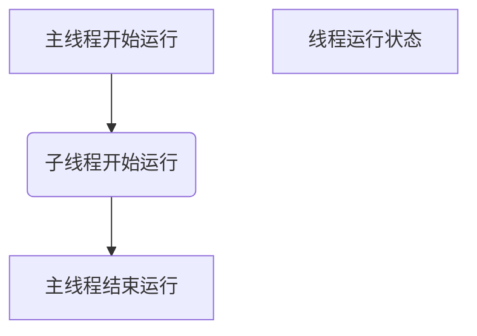

# python多线程

## 1.threading模块

threading模块是基于thread底层的模块，对thread做了一些包装的，可以更加方便的被使用的多线程包

**调用结构：**

```
import threading
# 创建线程对象
对象名 = threading.Thread(target=函数名)
对象名.start()
```

**Thread(参数解析)**

| 参数名 | 含义                                                         |
| ------ | ------------------------------------------------------------ |
| group  | 应为None；保留用于实现ThreadGroup类时的将来扩展              |
| target | 要调用的可调用对象。默认为“无”，表示不调用任何内容。         |
| name   | 是线程名。默认情况下，唯一的名称由“Thread-N”构成，其中N是一个小的十进制数。 |
| args   | 是目标调用的参数元组。默认为（）。                           |
| kwargs | 是目标调用的关键字参数字典。默认为{}。                       |

demo:

```python
import threading


def say_something():
    print("hello world!")


if __name__ == '__main__':
    for i in range(5):
        t = threading.Thread(target=say_something)
        t.start()
```

运行结果：

```
hello world!
hello world!
hello world!
hello world!hello world!
```

**说明**

1. 可以明显看出使用了多线程并发的操作，花费时间要短很多
2. 当调用`start()`时，才会真正地创建线程，并且开始执行


## 2.主线程和子线程的关系

**主线程：**

程序开始运行解释器自动创建。

 **python线程运行顺序**



**代码验证：**

demo:

```python
import threading
from time import sleep, ctime


def sing():
    for i in range(1, 4):
        print("唱歌---%s" % i)
        sleep(1)


def dance():
    for i in range(1, 4):
        print("跳舞---%s" % i)
        sleep(1)


if __name__ == '__main__':
    print("——————开始工作————:%s" % ctime())

    t1 = threading.Thread(target=sing)
    t2 = threading.Thread(target=dance)
    t1.start()
    t2.start()
    sleep(5)  # 这里延时是为了等待线程运行结束
    print('---结束工作---:%s' % ctime())
```

运行结果：

```
——————开始工作————:Wed Jun 17 14:50:24 2020
唱歌---1
跳舞---1
唱歌---2
跳舞---2
唱歌---3
跳舞---3
---结束工作---:Wed Jun 17 14:50:29 2020
```


验证结论：

* 当整个程序代码运行结束，主线程才会结束也就是程序终止
* 主线程会等待所有子线程运行结束之后，才结束，并清理线程资源
* 线程执行的顺序是无序的


## 3. 查看线程数量-threading.enumerate()

**threading.enumerate() 返回线程对象列表**

结构：

```
import threading
# 创建线程对象
对象名 = threading.Thread(target=函数名)
对象名.start()
print("线程数量为：%s"%threading.enumerate())
```

demo:

```python
import threading
from time import sleep


def sing():
    for i in range(1, 4):
        print("唱歌---%s" % i)
        sleep(1)


def dance():
    for i in range(1, 4):
        print("跳舞---%s" % i)
        sleep(1)


if __name__ == '__main__':
    t1 = threading.Thread(target=sing)
    t2 = threading.Thread(target=dance)
    t1.start()
    t2.start()
    
    while True:
        length = len(threading.enumerate())
        print(threading.enumerate())
        print('当前运行的线程数为：%d'%length)
        if length<=1:
            break
        sleep(0.5)
```

运行结果：

```
唱歌---1
跳舞---1
[<_MainThread(MainThread, started 4375117248)>, <Thread(Thread-1, started 123145525432320)>, <Thread(Thread-2, started 123145542221824)>]
当前运行的线程数为：3
[<_MainThread(MainThread, started 4375117248)>, <Thread(Thread-1, started 123145525432320)>, <Thread(Thread-2, started 123145542221824)>]
当前运行的线程数为：3
跳舞---2
唱歌---2
[<_MainThread(MainThread, started 4375117248)>, <Thread(Thread-1, started 123145525432320)>, <Thread(Thread-2, started 123145542221824)>]
当前运行的线程数为：3
[<_MainThread(MainThread, started 4375117248)>, <Thread(Thread-1, started 123145525432320)>, <Thread(Thread-2, started 123145542221824)>]
当前运行的线程数为：3
跳舞---3
唱歌---3
[<_MainThread(MainThread, started 4375117248)>, <Thread(Thread-1, started 123145525432320)>, <Thread(Thread-2, started 123145542221824)>]
当前运行的线程数为：3
[<_MainThread(MainThread, started 4375117248)>, <Thread(Thread-1, started 123145525432320)>, <Thread(Thread-2, started 123145542221824)>]
当前运行的线程数为：3
[<_MainThread(MainThread, started 4375117248)>]
当前运行的线程数为：1
```

可以看到每次线程列表中都有三个线程数，一个主线程，2个子线程。


## 4. 线程执行代码的封装

为了让每个线程的封装性更完美，所以使用threading模块时，往往会定义一个新的子类class，只要继承`threading.Thread`就可以了，然后重写`run`方法。

结构：

```
# 定义一个类继承threading.Thread
class 类名称(threading.Thread):
  # 提供run()方法
    def run(self):
        代码
```

demo:

```python
import threading


class MyThread(threading.Thread):
    def run(self):
        print("%s:线程运行了" % self.name)


if __name__ == '__main__':
    a = MyThread()
    a.start()
    b = MyThread()
    b.start()
```

运行结果：

```
Thread-1:线程运行了Thread-2:线程运行了
```

**说明**

- python的threading.Thread类有一个run方法，用于定义线程的功能函数，可以在自己的线程类中覆盖该方法。而创建自己的线程实例后，通过Thread类的start方法，可以启动该线程，交给python虚拟机进行调度，当该线程获得执行的机会时，就会调用run方法执行线程。


## 5.线程的执行顺序

demo:

```python
import threading
from time import sleep


class MyThread(threading.Thread):
    def run(self):
        sleep(1)
        print("%s:线程运行了" % self.name)


if __name__ == '__main__':
    for i in range(10):
        a = MyThread()
        a.start()
```

运行结果：

```
Thread-1:线程运行了
Thread-2:线程运行了
Thread-7:线程运行了
Thread-6:线程运行了
Thread-3:线程运行了
Thread-10:线程运行了
Thread-9:线程运行了
Thread-5:线程运行了
Thread-4:线程运行了
Thread-8:线程运行了
```

**说明**

从代码和执行结果我们可以看出，多线程程序的执行顺序是不确定的。当执行到sleep语句时，线程将被阻塞（Blocked），到sleep结束后，线程进入就绪（Runnable）状态，等待调度。而线程调度将自行选择一个线程执行。上面的代码中只**能保证每个线程都运行完整个run函数，但是线程的启动顺序、run函数中每次循环的执行顺序都不能确定。**


**总结**

- 每个线程默认有一个名字，尽管上面的例子中没有指定线程对象的name，但是python会自动为线程指定一个名字。
- 当线程的run()方法结束时该线程完成。
- 无法控制线程调度程序，但可以通过别的方式来影响线程调度的方式。


**如何保持线程按顺序运行？**

在两个子线程之间添加上足量的延迟

