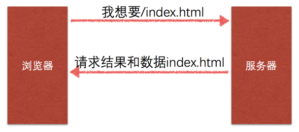

# HTTP协议

## 1.浏览器请求的基本流程


**基本过程：**

1. 用户输入网址.
2. 浏览器请求DNS服务器, 获取域名对应的IP地址.
3. 请求连接该IP地址服务器.
4. 发送资源请求. (HTTP协议)
5. web服务器接收到请求, 并解析请求, 判断用户意图.
6. 获取用户想要的资源.
7. 将资源返回给web服务器程序.
8. web服务器程序将资源数据通过网络发送给浏览器.
9. 浏览器解析请求的数据并且完成网页数据的显示.

> 域名是什么呢?

我们在访问一台服务器的时候, 需要记住该服务器的IP地址, 由于IP地址不利于人们记忆, 所以推出的域名技术. 域名是由一串用点分隔的名字组成的 Internet 上某一台计算机或计算机组的名称, 用于在数据传输时标识计算机的位置.

域名可以用来表示一个单位、机构或可以利用个人在 Internet上 的确定的名称或位置. 域名是惟一的. 客户可以利用这个名字找寻有关的产品和服务信息.

> DNS 是什么呢？

由于我们用域名来标识计算机的位置, 但是我们前面讲过, 网络上标识主机的唯一标识是IP地址, 所以就需要记录一下, 一个域名和IP地址的对应关系, 这个对应关系就存储在DNS服务器中, 当我们向DNS发出请求时, DNS会返回域名所对应的IP地址.


## 2.HTTP协议概述

### 2.1.HTTP协议简介

- 超文本传输协议（HyperText Transfer Protocol）是一种**应用层**协议。

HTTP是万维网的数据通信的基础。设计HTTP最初的目的是为了提供一种发布和接收HTML页面<网页>的方法。

- 1989年蒂姆·伯纳斯-李在C E R N研发
- 1999年公布现今广泛使用的HTTP 1.1版(RFC2616)

#### 2.1.1应用层

<<<<<<< HEAD:docs/36.http协议.md

=======

>>>>>>> a58a44b77d2769c5de11c61c13076de26e368f13:content/7.python高级知识-http服务器案例/1.http协议.md

**从下到上每层的作用：**

1. 链路层(数据链路层/网络接口层):包括操作系统中的设备驱动程序、计算机中对应的网络接口卡.
2. 网络层:处理分组在网络中的活动,比如分组的选路.
3. 运输层:主要为两台主机上的应用提供端到端的通信.
4. 应用层:负责处理特定的应用程序细节.

#### 2.1.2请求－响应模式



### 2.2.使用浏览器分析通信过程和格式

这里介绍 谷歌开发者工具使用

windows和Linux平台按F12调出开发者工具, MAC选择 视图 -> 开发者工具。

在 web 应用中, 服务器把网页传给浏览器, 实际就是把网页的 HTML 代码发送给浏览器, 浏览器解析显示出来. 而浏览器和服务器之间的传输应用层协议就是 HTTP. 所以:

- HTML 是一种用来定义网页的文本, 会 HTML 就可以编写网页.
- HTTP 是用来在网络上传输 HTML 文本的协议, 用于浏览器和服务器的通信.

Chrome 浏览器提供了一套完成的开发者工具, 很适合 web 开发者.


- 元素(Elements):用于查看或修改HTML元素的属性、CSS属性、监听事件、断点等.
- 控制台(Console):控制台一般用于执行一次性代码, 查看JavaScript对象, 查看调试日志信息或异常信息.
- 源代码(Sources):该页面用于查看页面的HTML文件源代码、JavaScript源代码、CSS源代码, 此外最重要的是可以调试JavaScript源代码, 可以给JS代码添加断点等.
- 网络(Network):网络页面主要用于查看header等,与网络连接相关的信息.

**注意**: Network 中的每一项就是一次请求/响应过程, 点击每一项, 可查看本次请求响应的报文信息.


## 3.HTTP 请求报文协议分析

Request Headers 中就是请求的报文数据内容. 下面就是我们要请求的报文示例数据:

```
GET / HTTP/1.1
Host: localhost:10000
Connection: keep-alive
User-Agent: Mozilla/5.0 (Macintosh; Intel Mac OS X 10_13_3) AppleWebKit/537.36 (KHTML, like Gecko) Chrome/64.0.3282.186 Safari/537.36
Accept: text/html,application/xhtml+xml,application/xml;q=0.9,image/webp,image/apng,*/*;q=0.8
Accept-Encoding: gzip, deflate, br
Accept-Language: zh-CN,zh;q=0.9,en;q=0.8,zh-TW;q=0.7
```

GET / HTTP/1.1 叫做请求行. 里面包含3个信息, 以空格隔开,

- 第一个叫做请求方法, 除了 GET 方法之外, 还有 POST 方法, 除此之外还有其他方法, 这两种最常用. GET 主要用于从服务器获得数据, POST 主要用于从浏览器提交数据到服务器. 比如像百度首页提供的上传图片的功能, 就是用POST方式.
- 第二个表示请求的资源路径. 当请求的URL是 https://www.baidu.com/, 那么我们会发现 路径会显示 '/', 那么如果请求的URL是 https://www.baidu.com/index.html, 我们会发现路径显示是 '/index.html'.
- 第三个表示 HTTP 协议的版本, 那么既然有 1.1版本， 前置版本肯定是1.0了，那么两个版本有什么区别呢? 1.1版本比1.0的版本主要多个一些请求方法等扩充协议的内容.


**问题: 如果用户请求路径是 https://www.baidu.com/abc.png, 那么资源路径会显示为什么呢?**

1. 请求头. 除了第一行之外, 剩下的所有数据的格式都是类似的.
    - Host 表示浏览器要请求的主机地址. 这是我们查看下 baidu.com， 请求不同的网站, 会有不同的主机地址.
    - Connection 表示浏览器和服务器之间的连接方式, 浏览器和服务器连接是长连接还是短连接, 稍后会讲解.
    - User-Agent 用户代理, 我们使用谷歌浏览器和火狐浏览器分别请求百度, 那么会发现 User-Agent 的值是不一样的, 它主要是用于浏览器告诉服务器自己的身份, 比如浏览器端使用的操作系统是什么版本, 浏览器是什么版本等等. 服务器端为什么需要知道这个信息呢? 我们后面会讲到爬虫，爬虫程序主要是从服务器端获取数据, 那么服务器端就会有反爬机制, 服务器不希望爬虫来获取数据, 所以通过该项可以知道客户端是否是爬虫程序. 如果爬虫程序想伪装成一个浏览器的请求, 就必须设置此项.
    - Accept 表示浏览器告诉服务器, 自己能够接收并识别的文件类型.
    - Accept-Encoding 表示浏览器能够处理的压缩方式. 为什么需要压缩呢？ 当网页数据量大的时候, 压缩之后可以提高传输速率, 提高用户体验.
    - Accept-Language 浏览器可以接收的文本语言, 如果非中文编码可能会出现乱码.

### 3.1.请求报文格式总结

| 格式   | 内容                                                    |
| ------ | ------------------------------------------------------- |
| 请求行 | 请求方法 资源路径 HTTP版本\r\n    eg:GET / HTTP/1.1\r\n |
| 请求头 | 头名称:头对应的值\r\n  eg:Host:localhost:1000/r/n       |
| 空行   | \r\n                                                    |
| 请求体 | 1.name=abc&age=80 2.二进制数据(例如上传图片)            |


## 4.HTTP 响应报文协议分析

```
HTTP/1.1 200 OK
Connection: Keep-Alive
Content-Encoding: gzip
Content-Type: text/html; charset=utf-8
Date: Wed, 14 Mar 2018 09:52:48 GMT
Server: BWS/1.1
```

* 第一行 HTTP/1.1 200 OK 叫做响应行, 共分成3部分, 第一部分 HTTP/1.1 表示 HTTP协议的版本, 第二部分是一个数字, 这个数字表示响应状态码, 用户向服务器发出了请求, 如果服务器正常返回响应报文, 那么状态码一般都是200, 第三部分的 "OK" 表示原因短语, 表示对前面状态码的简单描述. 这里需要说的是, 响应的状态码除了 200 之外, 还有其他的状态码, 下面是常见的状态码:

    * 302 redirect, 我们通过 302 状态码可以指示浏览器跳转到某一个 URL.

    * 404 NOT FOUND, 当我们访问一个不存在的 URL 时, 一般会返回404 状态码, 告诉浏览器, 你访问的 URL 是不存在的.
    * 500 Internal Server Error, 服务器遇到了一个未曾预料的状况, 导致了它无法完成对请求的处理. 一般来说, 这个问题都会在服务器端的源代码出现错误时出现.

* 第二行下面的所有内容, 我们叫做响应头. Content-Type 表示响应内容的文本格式和编码方式.

### 4.1.响应报文格式总结

| 格式     | 内容                                                         |
| -------- | ------------------------------------------------------------ |
| 响应行   | HTTP版本 状态码 原因短语\r\n   eg:HTTP/1.1 200 OK\r\n        |
| 响应头   | 头名称:头对应的值\r\n  eg:Content-Type: text/html; charset=utf-8 |
| 空行     | \r\n                                                         |
| 响应内容 | Hello world                                                  |


## 5.长连接短连接

在HTTP/1.0中, 默认使用的是短连接.也就是说, 浏览器和服务器每进行一次HTTP操作, 就建立一次连接, 但任务结束就中断连接.如果客户端浏览器访问的某个HTML或其他类型的 Web 页中包含有其他的Web资源，如js文件、图像文件、CSS文件等；当浏览器每遇到这样一个Web资源，就会建立一个HTTP会话。

但从 HTTP/1.1起，默认使用长连接，用以保持连接特性。使用长连接的HTTP协议，会在响应头有加入这行代码:

```
Connection:keep-alive
```

在真正的读写操作之前，server与client之间必须建立一个连接，

当读写操作完成后，双方不再需要这个连接时它们可以释放这个连接，

连接的建立通过三次握手，释放则需要四次握手，

所以说每个连接的建立都是需要资源消耗和时间消耗的。

