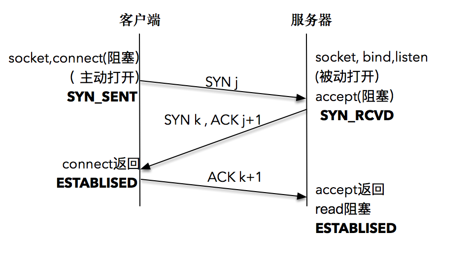
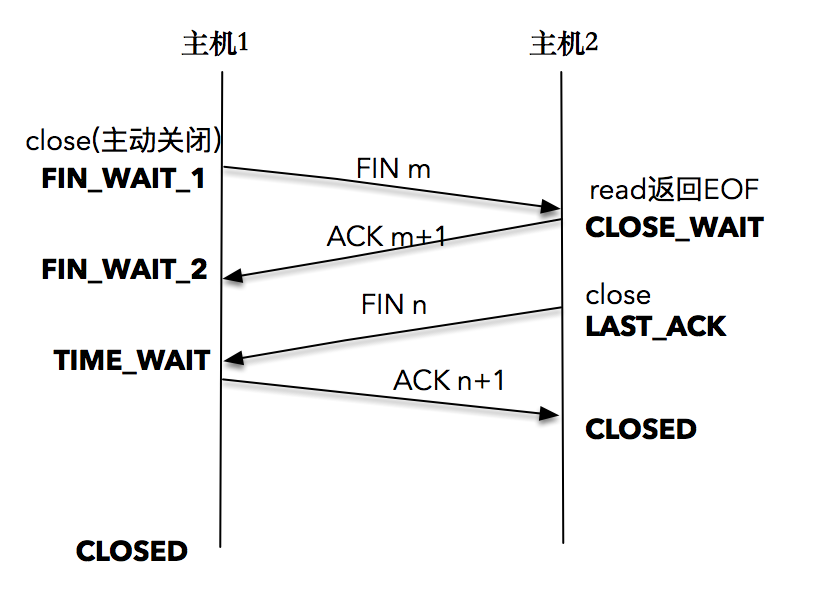

# TCP三次握手四次挥手

## 1.TCP三次握手

我们先看一下最初的过程，服务器端通过 socket，bind 和 listen 完成了被动套接字的准备工作，被动的意思就是等着别人来连接，然后调用 accept，就会阻塞在这里，等待客户端的连接来临；客户端通过调用 socket 和 connect 函数之后，也会阻塞。接下来的事情是由操作系统内核完成的，更具体一点的说，是操作系统内核网络协议栈在工作。

下面是具体的过程：

1. 客户端的协议栈向服务器端发送了 SYN 包，并告诉服务器端当前发送序列号 j，客户端进入 SYN_SENT 状态；
2. 服务器端的协议栈收到这个包之后，和客户端进行 ACK 应答，应答的值为 j+1，表示对 SYN 包 j 的确认，同时服务器也发送一个 SYN 包，告诉客户端当前我的发送序列号为 k，服务器端进入 SYNC_RCVD 状态；
3. 客户端协议栈   收到 ACK 之后，使得应用程序从 connect 调用返回，表示客户端到服务器端的单向连接建立成功，客户端的状态为 ESTABLISHED，同时客户端协议栈也会对服务器端的 SYN 包进行应答，应答数据为 k+1；
4. 应答包到达服务器端后，服务器端协议栈使得 accept 阻塞调用返回，这个时候服务器端到客户端的单向连接也建立成功，服务器端也进入 ESTABLISHED 状态。

形象一点的比喻是这样的，有 A 和 B 想进行通话：

- A 先对 B 说：“喂，你在么？我在的，我的口令是 j。
- ”B 收到之后大声回答：“我收到你的口令 j 并准备好了，你准备好了吗？我的口令是 k。
- ”A 收到之后也大声回答：“我收到你的口令 k 并准备好了，我们开始吧。

”可以看到，这样的应答过程总共进行了三次，这就是 TCP 连接建立之所以被叫为“三次握手”的原因了。

## 2.TCP四次挥手

1. 首先，一方应用程序调用 close，我们称该方为主动关闭方，该端的 TCP 发送一个 FIN 包，表示需要关闭连接。之后主动关闭方进入 FIN_WAIT_1 状态。
2. 接着，接收到这个 FIN 包的对端执行被动关闭。这个 FIN 由 TCP 协议栈处理，我们知道，TCP 协议栈为 FIN 包插入一个文件结束符 EOF 到接收缓冲区中，应用程序可以通过 read 调用来感知这个 FIN 包。一定要注意，这个 EOF 会被放在已排队等候的其他已接收的数据之后，这就意味着接收端应用程序需要处理这种异常情况，因为 EOF 表示在该连接上再无额外数据到达。此时，被动关闭方进入 CLOSE_WAIT 状态。
3. 接下来，被动关闭方将读到这个 EOF，于是，应用程序也调用 close 关闭它的套接字，这导致它的 TCP 也发送一个 FIN 包。这样，被动关闭方将进入 LAST_ACK 状态。
4. 最终，主动关闭方接收到对方的 FIN 包，并确认这个 FIN 包。主动关闭方进入 TIME_WAIT 状态，而接收到 ACK 的被动关闭方则进入 CLOSED 状态。经过 2MSL 时间之后，主动关闭方也进入 CLOSED 状态。

你可以看到，每个方向都需要一个 FIN 和一个 ACK，因此通常被称为四次挥手。

当然，这中间使用 shutdown，执行一端到另一端的半关闭也是可以的。当套接字被关闭时，TCP 为其所在端发送一个 FIN 包。在大多数情况下，这是由应用进程调用 close 而发生的，值得注意的是，一个进程无论是正常退出（exit 或者 main 函数返回），还是非正常退出（比如，收到 SIGKILL 信号关闭，就是我们常常干的 kill -9），所有该进程打开的描述符都会被系统关闭，这也导致 TCP 描述符对应的连接上发出一个 FIN 包。

无论是客户端还是服务器，任何一端都可以发起主动关闭。大多数真实情况是客户端执行主动关闭，你可能不会想到的是，HTTP/1.0 却是由服务器发起主动关闭的。