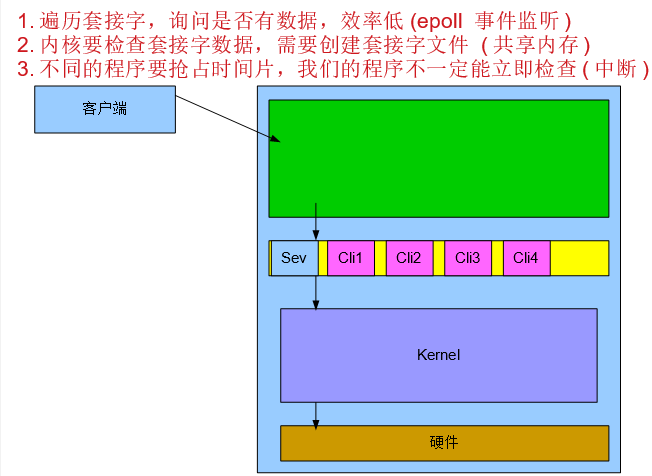

# web静态服务器epoll

仅仅支持Linux2.5.44或更高版本。

## 1.IO多路复用

就是我们说的select，poll，epoll，有些地方也称这种IO方式为event driven IO。

select/epoll的好处就在于单个process就可以同时处理多个网络连接的IO。

它的基本原理就是select，poll，epoll这个function会不断的轮询所负责的所有socket，当某个socket有数据到达了，就通知用户进程。

## 2.epoll原理

我们之前处理客户端请求会

1.遍历每一个套接字，询问是否有数据，效率低

2.系统内核要检查server套接字数据，需要client创建套接字文件

3.不同的程序运行要抢占时间片，我们的陈旭不一定能立即检查

这就会导致我们的写的服务端的效率很低，承载用户量较少


epoll在运行时会开辟一个独立的进程共享空间（内存中），会把server套接字和client套接字放入之中，这时服务器中已经没有了。这个空间是系统内核和程序进程共享的。内核直接查看共享空间中client套接字是否有数据，没有删除操作。我们的程序会在独立的进程共享空间中一直等待，直到某一个套接字有数据时，触发程序（事件触发）。当其他进程运行时，这个时产生了数据会把其他进程中断。




## 3.epoll代码实现

```python
# -*- coding:utf-8 -*-
# epoll
import select
import socket

# 1.创建套接字
server_sock = socket.socket(socket.AF_INET, socket.SOCK_STREAM)
# 2.设置重复使用
server_sock.setsockopt(socket.SOL_SOCKET, socket.SO_REUSEADDR, 1)
# 3.绑定主机信息
server_sock.bind(("", 8080))
# 4.被动监听
server_sock.listen(128)

# 用来打印套接字对应的文件描述符
# print(server_sock.fileno())
# print(select.EPOLLIN|select.EPOLLET)

# 5.创建一个epoll对象
epoll = select.poll()

# 6.注册事件到epoll中
# epoll.register(fd, eventmask])
# 注意，如果fd已经注册过，则会发生异常
# 将创建的套接字添加到epoll的事件监听中
epoll.register(server_sock.fileno(), select.EPOLLIN)

# 创建两个字典来保存新连接的客户端信息
# 为什么要用字典而不是列表是为了，自动去重复
connections = {}
addresses = {}

# 7.循环等待客户端的到来或者对方发送数据
while True:
    # 8.epoll 进行 fd 扫描的地方 -- 未指定超时时间则为阻塞等待,获取共享空间中的事件和文件描述符
    epoll_List = epoll.poll()  # 结果：((文件描述符,事件)(文件描述符,事件)(文件描述符,事件))

    # 9.对事件进行判断
    for fd, events in epoll_List:
        # 如果是socket创建的套接字被激活
        if fd == server_sock.fileno():
            # 接收数据
            # 得到新客户端socket
            new_sock, new_addr = server_sock.accept()
            print('有新的客户端到来%s' % str(new_addr))
            connections[new_sock.fileno()] = new_sock
            addresses[new_sock.fileno()] = new_addr

            # 向epoll中注册新socket的可读事件
            epoll.register(new_sock.fileno(), select.EPOLLIN)

        # 如果是客户端发送数据
        elif events == select.EPOLLIN:
            # 直接接受数据
            recv_data = connections[fd].recv(1024).decode('utf-8')

            # 删除烂数据
            if recv_data:
                print('recv:%s' % recv_data)
            else:
                # 从 epoll 中移除该 连接 fd
                epoll.unregister(fd)

                # server 侧主动关闭该 连接 fd
                connections[fd].close()
                print("%s---offline---" % str(addresses[fd]))
                del connections[fd]
                del addresses[fd]
```

**说明**

- EPOLLIN （可读）
- EPOLLOUT （可写）
- EPOLLET （ET模式）

epoll对文件描述符的操作有两种模式：LT（level trigger）和ET（edge trigger）。LT模式是默认模式，LT模式与ET模式的区别如下：

```
LT模式：当epoll检测到描述符事件发生并将此事件通知应用程序，应用程序可以不立即处理该事件。下次调用epoll时，会再次响应应用程序并通知此事件。

ET模式：当epoll检测到描述符事件发生并将此事件通知应用程序，应用程序必须立即处理该事件。
```


## 4.web静态服务器-epoll

```python
# -*- coding:utf-8 -*-

# 封装成类
import re
import sys
import socket
import select


class WsgiServer(object):
    def __init__(self, server_address):
        # 1.创建套接字
        self.sock = socket.socket(socket.AF_INET, socket.SOCK_STREAM)

        # 2.允许立即使用上次绑定的port
        self.sock.setsockopt(socket.SOL_SOCKET, socket.SO_REUSEADDR, 1)

        # 3.绑定ip地址和端口
        self.sock.bind(server_address)

        # 4.设置被动套接字,并制定队列的长度
        self.sock.listen(128)

        # 5.设置socket为非阻塞
        self.sock.setblocking(False)

        # 6.创建一个epoll对象
        self.epoll = select.epoll()

        # 7.将tcp服务器套接字加入到epoll中进行监听
        self.epoll.register(self.sock.fileno(), select.EPOLLIN | select.EPOLLET)

        # 8.创建添加fd对应的套接字
        self.fd_socket = dict()

    def server_forever(self):
        """循环运行web服务器，等待客户端的链接并为客户端服务"""
        while True:
            # epoll 进行 fd 扫描的地方 -- 未指定超时时间则为阻塞等待,获取共享空间中的事件和文件描述符
            epoll_lists = self.epoll.poll()

            # 循环事件和文件描述符
            for fd, events in epoll_lists:

                # 判断事件和文件描述符类型是否属于客户端socket或者是服务端socket
                if fd == self.sock.fileno():  # 是服务端socket
                    try:
                        client_sock, client_ip = self.sock.accept()  # 结收客户端信息
                    except:
                        print("没有新的客户端连接。。。。。。。。")
                    else:
                        try:
                            client_sock.setblocking(False)
                        except:
                            print("客户端没有数据。。。。")
                        else:
                            # 向epoll中注册连接socket的可读事件
                            self.epoll.register(client_sock.fileno(), select.EPOLLET | select.EPOLLIN)
                            # 记录这个数据
                            self.fd_socket[client_sock.fileno()] = client_sock

                # 接收到数据说明这个socket是有数据的是客户端socket
                elif events == select.EPOLLIN:

                    request = self.fd_socket[fd].recv(1024).decode('utf-8')
                    # 判断数据是否存在
                    if request:
                        self.data_process(request, self.fd_socket[fd])
                    else:
                        # 在epoll中注销客户端的信息
                        self.epoll.unregister(fd)
                        # 关闭客户端的文件句柄
                        self.fd_socket[fd].close()
                        # 在字典中删除与已关闭客户端相关的信息
                        del self.fd_socket[fd]

    def data_process(self, request_data, sock):
        if not request_data:
            return

        """处理数据"""
        # 切割请求头
        request_header_lines = request_data.splitlines()

        # 打印测试
        for request_header_line in request_header_lines:
            print(request_header_line)

        # 获取请求行行信息：因为它包含请求的资源
        http_request_line = request_header_lines[0]

        # 正则切割出请求资源的文件名,eg:GET / HTTP/1.1
        request_file_name = re.match('[^/]+(/[^ ]*)', http_request_line).group(1)
        print(request_file_name)

        # 如果没有指定访问哪个页面。例如index.html
        # GET / HTTP/1.1
        if request_file_name == '/':
            request_file_name = DOCUMENTS_ROOT + "/index.html"
        else:
            request_file_name = DOCUMENTS_ROOT + request_file_name
        print(request_file_name)

        # 读取对应文件并返回
        try:
            f = open(request_file_name, 'rb')
        except IOError:
            # 404表示没有这个界面
            # 响应行
            response_header = 'HTTP/1.1 404  not found\r\n'

            # 响应头
            response_header += 'Server: PythonWebServer1.0\r\n'

            # 响应内容
            response_content = '====sorry ,file not found===='.encode('utf-8')

            # 解决长连接问题
            response_header += "Content-Type: text/html; charset=utf-8\r\n"
            response_header += "Content-Length:%d\r\n" % len(response_content)

            # 空行
            response_header += '\r\n'

        else:
            # 404表示没有这个界面
            # 响应行
            response_header = 'HTTP/1.1 200 OK\r\n'

            # 响应头
            response_header += 'Server: PythonWebServer1.0\r\n'

            # 响应内容
            response_content = f.read()

            # 解决长连接问题
            response_header += "Content-Type: text/html; charset=utf-8\r\n"
            response_header += "Content-Length:%d\r\n" % len(response_content)

            # 空行
            response_header += '\r\n'

            f.close()
        finally:
            # 拼接发送
            print(response_header)
            response_data = (response_header.encode('utf-8')) + response_content
            sock.send(response_data)


# 设置静态资源路径
DOCUMENTS_ROOT = './html/html'


def main():
    """程序运行入口"""
    # python3 xxxx.py 7890
    if len(sys.argv) == 2:
        port = sys.argv[1]
        if port.isdigit():
            port = int(port)
    else:
        print("运行方式如: python3 xxx.py 7890")
        return
    SERVER_ADDR = ('', port)
    print("http服务器使用的port:%s" % port)
    httpd = WsgiServer(SERVER_ADDR)
    httpd.server_forever()


if __name__ == '__main__':
    main()
```

**小总结**

I/O 多路复用的特点：

通过一种机制使一个进程能同时等待多个文件描述符，而这些文件描述符（套接字描述符）其中的任意一个进入读就绪状态，epoll()函数就可以返回。 所以, IO多路复用，本质上不会有并发的功能，因为任何时候还是只有一个进程或线程进行工作，它之所以能提高效率是因为select\epoll 把进来的socket放到他们的 '监视' 列表里面，当任何socket有可读可写数据立马处理，那如果select\epoll 手里同时检测着很多socket， 一有动静马上返回给进程处理，总比一个一个socket过来,阻塞等待,处理高效率。

当然也可以多线程/多进程方式，一个连接过来开一个进程/线程处理，这样消耗的内存和进程切换页会耗掉更多的系统资源。 所以我们可以结合IO多路复用和多进程/多线程 来高性能并发，IO复用负责提高接受socket的通知效率，收到请求后，交给进程池/线程池来处理逻辑。